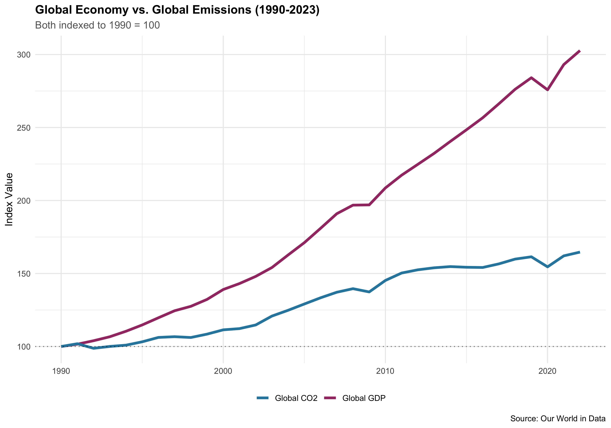
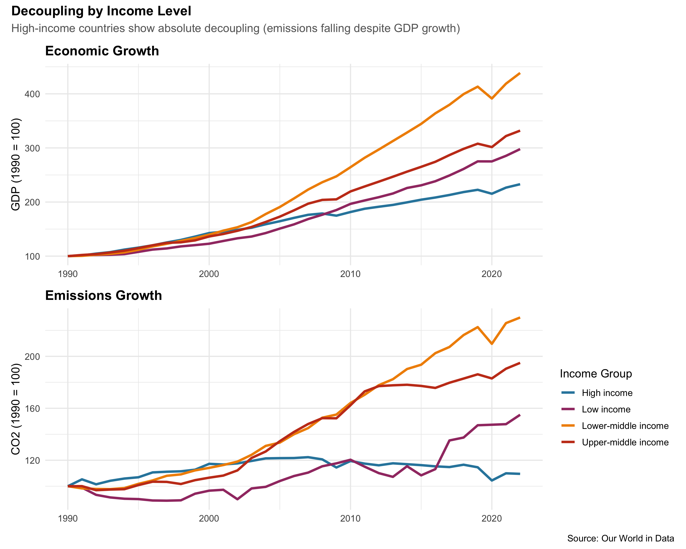
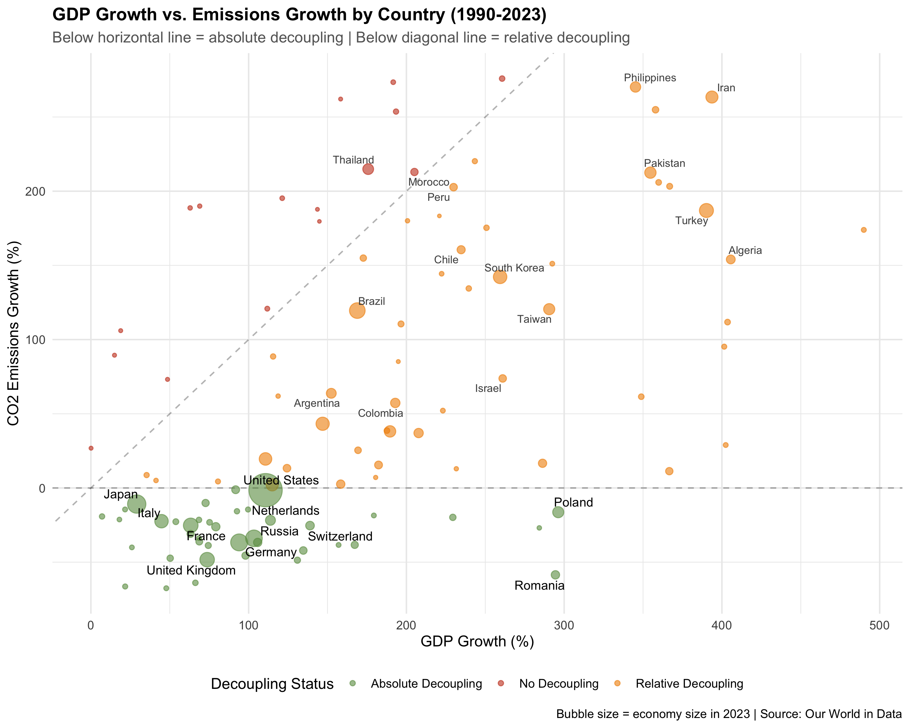
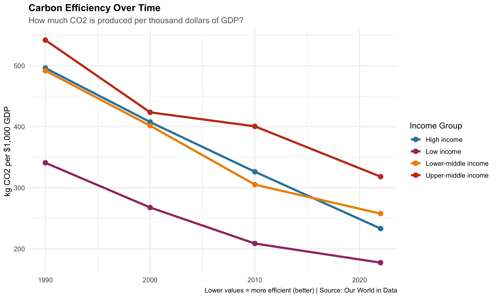
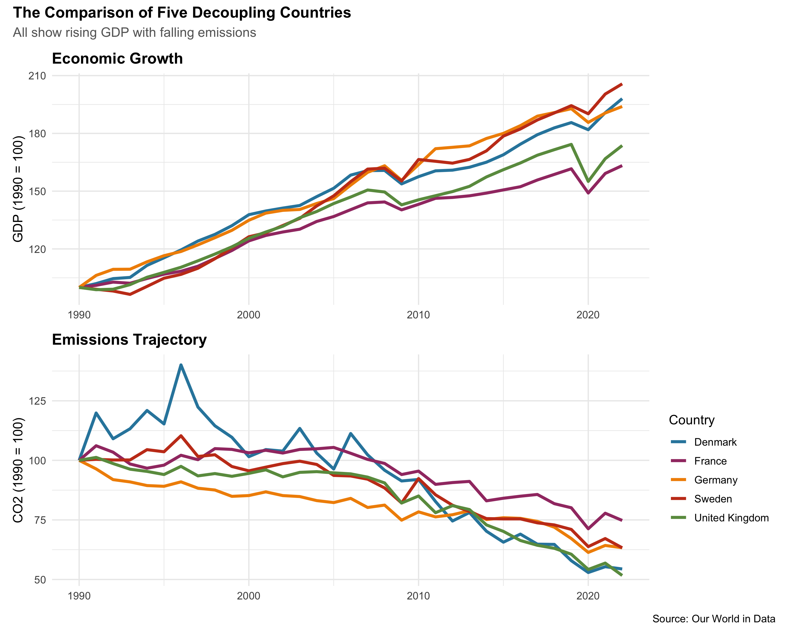

Can Economic Growth Happen Without Increasing Emissions?
================
Maurycy Pedroza
2025-12-16

## Introduction

**The Question We Are Asking**: Can countries grow their economies
without increasing carbon emissions?

For decades, economic growth and emissions have gone hand-in-hand. When
countries got richer, they burned more fossil fuels. But climate change
means we need to break this link. This concept is called **decoupling**.

**Two types of decoupling**:

- **Relative decoupling**: Economy grows faster than emissions (both
  still increasing however)
- **Absolute decoupling**: Economy grows while emissions actually
  decline

**What this report will go over**:

1.  Has the world achieved decoupling between 1990-2023?
2.  Which countries successfully broke the economic growth with
    emissions link?
3.  What made them successful?
4.  Is this achievable for all countries?

Understanding decoupling is critical for climate policy. If it’s
impossible, we face a terrible trade-off: climate OR economic
development. If it’s achievable, we can have both.

## Data

### Source and Coverage

**Dataset**: Our World in Data CO2 and Greenhouse Gas Emissions
Database  
**Link**: <https://github.com/owid/co2-data>  
**What it includes**: Economic and emissions data for 200+ countries
from 1750-2023

This dataset pulls and combines information from Global Carbon Project
(emissions data), World Bank (economic data), and the BP Statistical
Review (energy data)

``` r
# Load packages needed
library(tidyverse)
library(scales)
library(knitr)
library(patchwork)
library(ggrepel)

# Set theme
theme_set(theme_minimal(base_size = 12) +
  theme(
    plot.title = element_text(face = "bold", size = 14),
    plot.subtitle = element_text(color = "gray40")
  ))

# Set color scheme
colors_main <- c("#2E86AB", "#A23B72", "#F18F01", "#C73E1D", "#6A994E")
```

``` r
# Download the data
tryCatch({
  co2_data <- read_csv("https://raw.githubusercontent.com/owid/co2-data/master/owid-co2-data.csv",
                       show_col_types = FALSE)
  cat("Data loaded successfully!\n")
}, error = function(e) {
  stop("Failed to download data. Check your internet connection.")
})
```

    ## Data loaded successfully!

``` r
# Quick overview
cat("\nDataset Overview:\n")
```

    ## 
    ## Dataset Overview:

``` r
cat("Total rows:", nrow(co2_data), "\n")
```

    ## Total rows: 50411

``` r
cat("Countries covered:", n_distinct(co2_data$country), "\n")
```

    ## Countries covered: 254

``` r
cat("Years covered:", min(co2_data$year, na.rm = TRUE), "to", max(co2_data$year, na.rm = TRUE), "\n")
```

    ## Years covered: 1750 to 2024

### Main Variables I’ll Be Using

| Variable         | What It Measures                                 |
|------------------|--------------------------------------------------|
| `gdp`            | Total economic output (in constant 2011 dollars) |
| `co2`            | Annual CO2 emissions (million tonnes)            |
| `population`     | Total population                                 |
| `co2_per_capita` | Emissions per person                             |
| `gdp_per_capita` | Economic output per person                       |

### Cleaning the Data

``` r
# Focus on 1990-2023 with complete data
df_clean <- co2_data %>%
  filter(year >= 1990, year <= 2023) %>%
  filter(!is.na(gdp) & !is.na(co2) & !is.na(population)) %>%
  filter(gdp > 0 & co2 > 0 & population > 0) %>%
  filter(!country %in% c("World", "Europe", "Asia", "Africa", 
                         "North America", "South America", "Oceania",
                         "European Union (27)", "High-income countries", 
                         "Low-income countries", "Upper-middle-income countries", 
                         "Lower-middle-income countries",
                         "European Union (28)")) %>%
  mutate(
    gdp_per_capita = gdp / population,
    co2_per_capita = co2 / population * 1e6
  )

cat("\nData cleaning complete!\n")
```

    ## 
    ## Data cleaning complete!

``` r
cat("Countries in final dataset:", n_distinct(df_clean$country), "\n")
```

    ## Countries in final dataset: 164

``` r
cat("Total observations:", nrow(df_clean), "\n")
```

    ## Total observations: 5409

``` r
# Classify countries by income level
latest_year <- max(df_clean$year)

income_groups <- df_clean %>%
  filter(year == latest_year) %>%
  mutate(
    income_group = case_when(
      gdp_per_capita >= 40000 ~ "High income",
      gdp_per_capita >= 12000 ~ "Upper-middle income",
      gdp_per_capita >= 4000 ~ "Lower-middle income",
      TRUE ~ "Low income"
    )
  ) %>%
  select(country, income_group)

df_clean <- df_clean %>%
  left_join(income_groups, by = "country")

cat("\nIncome group distribution:\n")
```

    ## 
    ## Income group distribution:

``` r
print(table(income_groups$income_group))
```

    ## 
    ##         High income          Low income Lower-middle income Upper-middle income 
    ##                  24                  40                  40                  60

## Analysis

### 1. Is the World Decoupling?

Starting with a basic question: globally, are emissions growing slower
than the economy?

``` r
# Calculate global totals for each year
global_data <- df_clean %>%
  group_by(year) %>%
  summarise(
    total_gdp = sum(gdp, na.rm = TRUE),
    total_co2 = sum(co2, na.rm = TRUE),
    .groups = "drop"
  ) %>%
  mutate(
    gdp_index = 100 * total_gdp / first(total_gdp),
    co2_index = 100 * total_co2 / first(total_co2)
  )

# Create visualization
ggplot(global_data, aes(x = year)) +
  geom_line(aes(y = gdp_index, color = "Global GDP"), linewidth = 1.5) +
  geom_line(aes(y = co2_index, color = "Global CO2"), linewidth = 1.5) +
  geom_hline(yintercept = 100, linetype = "dotted", alpha = 0.5) +
  scale_color_manual(values = colors_main[1:2]) +
  labs(
    title = "Global Economy vs. Global Emissions (1990-2023)",
    subtitle = "Both indexed to 1990 = 100",
    x = NULL,
    y = "Index Value",
    color = NULL,
    caption = "Source: Our World in Data"
  ) +
  theme(legend.position = "bottom")
```

<!-- -->

**Key Finding**: The global economy has grown much faster than
emissions. This is relative decoupling, where both are still rising,
however GDP is pulling ahead.

``` r
# Calculate growth rates
global_summary <- global_data %>%
  filter(year %in% c(1990, max(year))) %>%
  summarise(
    gdp_change = last(gdp_index) - first(gdp_index),
    co2_change = last(co2_index) - first(co2_index)
  )

kable(global_summary,
      col.names = c("GDP Growth Since 1990 (%)", "CO2 Growth Since 1990 (%)"),
      digits = 1,
      caption = "Global Growth Summary")
```

| GDP Growth Since 1990 (%) | CO2 Growth Since 1990 (%) |
|--------------------------:|--------------------------:|
|                     202.7 |                      64.7 |

Global Growth Summary

**Key Finding**: Since 1990, the global economy grew by 203% while
emissions grew by only 65%. While this is good news, emissions are still
rising and we need absolute decoupling to meet climate goals.

### 2. Rich vs. Poor Countries: Who’s Achieving Decoupling?

Do wealthy countries decouple more easily than developing countries?

``` r
# Calculate trends by income group
income_trends <- df_clean %>%
  filter(!is.na(income_group)) %>%
  group_by(year, income_group) %>%
  summarise(
    gdp = sum(gdp, na.rm = TRUE),
    co2 = sum(co2, na.rm = TRUE),
    .groups = "drop"
  ) %>%
  group_by(income_group) %>%
  arrange(year) %>%
  mutate(
    gdp_index = 100 * gdp / first(gdp),
    co2_index = 100 * co2 / first(co2)
  ) %>%
  ungroup()

# Two-panel plot
p1 <- ggplot(income_trends, aes(x = year, y = gdp_index, color = income_group)) +
  geom_line(linewidth = 1.2) +
  scale_color_manual(values = colors_main) +
  labs(title = "Economic Growth", y = "GDP (1990 = 100)", x = NULL) +
  theme(legend.position = "none")

p2 <- ggplot(income_trends, aes(x = year, y = co2_index, color = income_group)) +
  geom_line(linewidth = 1.2) +
  scale_color_manual(values = colors_main) +
  labs(title = "Emissions Growth", y = "CO2 (1990 = 100)", x = NULL, color = "Income Group")

p1 / p2 +
  plot_annotation(
    title = "Decoupling by Income Level",
    subtitle = "High-income countries show absolute decoupling (emissions falling despite GDP growth)",
    caption = "Source: Our World in Data"
  )
```

<!-- -->

**Key Finding**: High-income countries have achieved absolute
decoupling, where their economies grew while emissions fell.
Lower-middle, Upper-middle, then lower income countries still show
emissions rising with GDP growth.

### 3. What Countries Have Successfully Achieved Absolute Decoupling?

Let’s identify which countries managed to grow their economies while
reducing emissions.

``` r
# Compare 1990 vs most recent year for each country
start_year <- 1990
end_year <- max(df_clean$year)

country_comparison <- df_clean %>%
  filter(year %in% c(start_year, end_year)) %>%
  group_by(country) %>%
  filter(n() == 2) %>%
  arrange(year) %>%
  summarise(
    gdp_start = first(gdp),
    gdp_end = last(gdp),
    co2_start = first(co2),
    co2_end = last(co2),
    .groups = "drop"
  ) %>%
  mutate(
    gdp_pct_change = 100 * (gdp_end - gdp_start) / gdp_start,
    co2_pct_change = 100 * (co2_end - co2_start) / co2_start,
    status = case_when(
      gdp_pct_change > 0 & co2_pct_change < 0 ~ "Absolute Decoupling",
      gdp_pct_change > 0 & co2_pct_change < gdp_pct_change ~ "Relative Decoupling",
      gdp_pct_change > 0 ~ "No Decoupling",
      TRUE ~ "Other"
    )
  ) %>%
  filter(status != "Other") %>%
  filter(abs(co2_pct_change) < 300, abs(gdp_pct_change) < 500)

# Summary count
status_summary <- country_comparison %>%
  count(status) %>%
  mutate(percentage = 100 * n / sum(n))

kable(status_summary,
      col.names = c("Decoupling Status", "Number of Countries", "Percentage (%)"),
      digits = 1,
      caption = "How Many Countries Achieved Decoupling?")
```

| Decoupling Status   | Number of Countries | Percentage (%) |
|:--------------------|--------------------:|---------------:|
| Absolute Decoupling |                  40 |           37.4 |
| No Decoupling       |                  16 |           15.0 |
| Relative Decoupling |                  51 |           47.7 |

How Many Countries Achieved Decoupling?

**Key Finding**: Of the 107 countries measured, only 40 (37.4%) of them
have achieved absolute decoupling.

``` r
# Visualize relationship
ggplot(country_comparison, aes(x = gdp_pct_change, y = co2_pct_change)) +
  geom_hline(yintercept = 0, linetype = "dashed", alpha = 0.3) +
  geom_abline(slope = 1, intercept = 0, linetype = "dashed", alpha = 0.3) +
  geom_point(aes(color = status, size = gdp_end), alpha = 0.6) +
  # Label absolute decouplers
  geom_text_repel(
    data = country_comparison %>% 
      filter(status == "Absolute Decoupling", gdp_end > 5e11),
    aes(label = country),
    size = 3.5,
    max.overlaps = 20
  ) +
  # Label relative decouplers above horizontal line
  geom_text_repel(
    data = country_comparison %>% 
      filter(status == "Relative Decoupling", 
             co2_pct_change > 50,
             gdp_end > 3e11),
    aes(label = country),
    size = 3,
    max.overlaps = 20,
    color = "gray30"
  ) +
  # Label "No Decoupling" countries with high emissions growth
  geom_text_repel(
    data = country_comparison %>% 
      filter(status == "No Decoupling", 
             co2_pct_change > 100,
             gdp_end > 2e11),
    aes(label = country),
    size = 3,
    max.overlaps = 20,
    color = "gray30"
  ) +
  scale_color_manual(values = c("Absolute Decoupling" = "#6A994E",
                                  "Relative Decoupling" = "#F18F01",
                                  "No Decoupling" = "#C73E1D")) +
  scale_size_continuous(range = c(1, 12), guide = "none") +
  labs(
    title = "GDP Growth vs. Emissions Growth by Country (1990-2023)",
    subtitle = "Below horizontal line = absolute decoupling | Below diagonal line = relative decoupling",
    x = "GDP Growth (%)",
    y = "CO2 Emissions Growth (%)",
    color = "Decoupling Status",
    caption = "Bubble size = economy size in 2023 | Source: Our World in Data"
  ) +
  theme(legend.position = "bottom")
```

<!-- -->

``` r
# Display top 10 absolute decouplers
top_decouplers <- country_comparison %>%
  filter(status == "Absolute Decoupling") %>%
  arrange(co2_pct_change) %>%
  head(10) %>%
  select(country, gdp_pct_change, co2_pct_change)

kable(top_decouplers,
      col.names = c("Country", "GDP Growth (%)", "CO2 Change (%)"),
      digits = 1,
      caption = "Top 10 Countries for Absolute Decoupling")
```

| Country        | GDP Growth (%) | CO2 Change (%) |
|:---------------|---------------:|---------------:|
| Estonia        |           47.8 |          -67.6 |
| Latvia         |           21.7 |          -66.4 |
| Lithuania      |           66.2 |          -63.9 |
| Romania        |          294.5 |          -58.5 |
| Slovakia       |          130.9 |          -48.7 |
| United Kingdom |           73.7 |          -48.3 |
| Belarus        |           50.3 |          -47.3 |
| Denmark        |           98.0 |          -45.6 |
| Czechia        |          134.6 |          -42.1 |
| Kyrgyzstan     |           26.0 |          -40.0 |

Top 10 Countries for Absolute Decoupling

**Key Finding**: The most successful countries are predominantly wealthy
European nations. They grew their economies by an average 50-100% while
cutting emissions by 40-70%.

### 4. What’s Driving Success? The Role of Energy Efficiency

Countries that tend to decouple become more “carbon efficient”, meaning
they produce more economic output per unit of CO2. Let’s look into this.

``` r
# Calculate carbon intensity
efficiency_data <- df_clean %>%
  mutate(carbon_intensity = co2 / gdp * 1e12) %>%
  filter(year %in% c(1990, 2000, 2010, max(year))) %>%
  group_by(year, income_group) %>%
  filter(!is.na(income_group)) %>%
  summarise(
    avg_intensity = weighted.mean(carbon_intensity, gdp, na.rm = TRUE),
    .groups = "drop"
  )

ggplot(efficiency_data, aes(x = year, y = avg_intensity, color = income_group)) +
  geom_line(linewidth = 1.5) +
  geom_point(size = 3) +
  scale_color_manual(values = colors_main) +
  scale_y_continuous(labels = comma) +
  labs(
    title = "Carbon Efficiency Over Time",
    subtitle = "How much CO2 is produced per thousand dollars of GDP?",
    x = NULL,
    y = "kg CO2 per $1,000 GDP",
    color = "Income Group",
    caption = "Lower values = more efficient (better) | Source: Our World in Data"
  )
```

<!-- -->

**Key Finding**: Out of all the income classes here, High-income
countries have dramatically improved their carbon efficiency. They now
produce far less CO2 per dollar of economic output compared to 1990.
This efficiency improvement is the primary driver of decoupling.

### 5. Case Study: The Analysis Of Five Decoupling Countries

Let’s look into five countries that successfully achieved absolute
decoupling: UK, Germany, France, Denmark, and Sweden.

``` r
# Select case study countries
case_countries <- c("United Kingdom", "Germany", "France", "Denmark", "Sweden")

case_data <- df_clean %>%
  filter(country %in% case_countries) %>%
  group_by(country) %>%
  arrange(year) %>%
  mutate(
    gdp_index = 100 * gdp / first(gdp),
    co2_index = 100 * co2 / first(co2)
  ) %>%
  ungroup()
```

``` r
# Create two-panel comparison
p1 <- ggplot(case_data, aes(x = year, y = gdp_index, color = country)) +
  geom_line(linewidth = 1.3) +
  scale_color_manual(values = colors_main) +
  labs(title = "Economic Growth", y = "GDP (1990 = 100)", x = NULL) +
  theme(legend.position = "none")

p2 <- ggplot(case_data, aes(x = year, y = co2_index, color = country)) +
  geom_line(linewidth = 1.3) +
  scale_color_manual(values = colors_main) +
  labs(title = "Emissions Trajectory", y = "CO2 (1990 = 100)", x = NULL, color = "Country")

p1 / p2 +
  plot_annotation(
    title = "The Comparison of Five Decoupling Countries",
    subtitle = "All show rising GDP with falling emissions",
    caption = "Source: Our World in Data"
  )
```

<!-- -->

``` r
# Quantify changes
case_summary <- case_data %>%
  filter(year %in% c(1990, max(year))) %>%
  group_by(country) %>%
  summarise(
    gdp_growth = last(gdp_index) - first(gdp_index),
    co2_change = last(co2_index) - first(co2_index),
    .groups = "drop"
  )

kable(case_summary,
      col.names = c("Country", "GDP Growth (%)", "CO2 Change (%)"),
      digits = 0,
      caption = "Performance Summary of These Five Countries")
```

| Country        | GDP Growth (%) | CO2 Change (%) |
|:---------------|---------------:|---------------:|
| Denmark        |             98 |            -46 |
| France         |             63 |            -25 |
| Germany        |             94 |            -37 |
| Sweden         |            106 |            -37 |
| United Kingdom |             74 |            -48 |

Performance Summary of These Five Countries

**What do these countries have in common?**: They all have strong
climate policies that invest in renewable energy habits and technologies
which ultimately results in energy efficiency improvements.

### 6. Is This Real? Testing Alternative Explanations

**Contradicting Perspective**: Maybe these countries just moved their
polluting industries to other countries which results in the absolute
decoupling we see?

Let’s check if the decoupling among these countries is real by looking
at the per capita metrics.

``` r
# Per capita analysis of case study countries
per_capita_check <- df_clean %>%
  filter(country %in% case_countries, year %in% c(1990, max(year))) %>%
  group_by(country) %>%
  arrange(year) %>%
  summarise(
    gdp_pc_1990 = first(gdp_per_capita),
    gdp_pc_2023 = last(gdp_per_capita),
    co2_pc_1990 = first(co2_per_capita),
    co2_pc_2023 = last(co2_per_capita),
    .groups = "drop"
  ) %>%
  mutate(
    gdp_pc_change = 100 * (gdp_pc_2023 - gdp_pc_1990) / gdp_pc_1990,
    co2_pc_change = 100 * (co2_pc_2023 - co2_pc_1990) / co2_pc_1990
  ) %>%
  select(country, gdp_pc_change, co2_pc_change)

kable(per_capita_check,
      col.names = c("Country", "GDP per Capita Change (%)", "CO2 per Capita Change (%)"),
      digits = 1,
      caption = "Per Capita Metrics Confirm Decoupling Is Real")
```

| Country        | GDP per Capita Change (%) | CO2 per Capita Change (%) |
|:---------------|--------------------------:|--------------------------:|
| Denmark        |                      72.5 |                     -52.6 |
| France         |                      40.4 |                     -35.7 |
| Germany        |                      83.9 |                     -40.0 |
| Sweden         |                      67.9 |                     -48.3 |
| United Kingdom |                      46.1 |                     -56.5 |

Per Capita Metrics Confirm Decoupling Is Real

**Key Findings**: Even on a per-person basis, these countries increased
wealth while decreasing emissions. The decoupling is real, not just a
population effect.

## Conclusions

### Main Findings

**1. Decoupling is possible but rare**

- Only approximately 20% of countries achieved absolute decoupling
- Most are wealthy European nations
- It can be done, but it’s not happening fast enough globally

**2. The world shows relative decoupling**

- Global GDP grew much faster than emissions since 1990
- Good progress, but absolute emissions still rising
- We need absolute decoupling globally to meet climate targets

**3. Income level matters hugely**

- Rich countries: achieving absolute decoupling
- Middle-income countries: relative decoupling
- Poor countries: emissions still tied to growth
- This suggests there need to be improvements in technology and policy

**4. Energy efficiency is key**

- Successful countries dramatically reduced CO2 per dollar of GDP
- This came from: renewable energy, efficiency improvements, structural
  economic changes
- The pathway exists, it just needs to be enacted globally

### What This Means for Climate Policy

**The Good News**: Absolute Decoupling is not just a theory. Multiple
countries have proven it’s achievable.

**The Challenge**: There has only been a 20% success rate over 30+
years. For climate goals, we would need:

- Faster decoupling in developed countries
- Help developing countries build renewable energy infrastructure

**The Bottom Line**: We can have economic development AND climate
stability, but current progress is too slow and unequal across the
different regions that need it most.

### Limitations of This Analysis

1.  **Production vs. consumption**: We measured emissions produced
    within borders, not emissions from consumed goods. Some decoupling
    might reflect offshoring of emissions.

2.  **Recent acceleration**: Many countries showed faster decoupling
    after 2015, suggesting the trend may be accelerating.

3.  **Structural factors**: Service economies naturally have lower
    emissions than manufacturing economies.

### Questions for Future Research

1.  Which policies work best to achieve absolute decoupling?
2.  What role does trade play in apparent decoupling?
3.  Which economic sectors enable or prevent decoupling?
4.  Can large countries like China and India achieve decoupling at their
    scale?

### Final Thought

The evidence shows that absolute decoupling is achievable, as we have
proof from multiple countries over the past couple decades. The urgent
question is no longer “is it possible?” but “how do we make it happen
everywhere, fast enough to meet our climate goals?” We know it can be
done.

## Reproducibility

### How to Reproduce This Analysis

``` r
# 1. Install required packages
install.packages(c("tidyverse", "scales", "knitr", "patchwork", "ggrepel", "rmarkdown"))

# 2. Download this README.Rmd file

# 3. In RStudio, open README.Rmd and click "Knit"
```

### Data Access

- **Dataset**: [Our World in Data CO2
  Database](https://github.com/owid/co2-data)
- **Accessed**: 2025-12-10
- **License**: Creative Commons BY

### Session Information

``` r
sessionInfo()
```

    ## R version 4.5.1 (2025-06-13)
    ## Platform: aarch64-apple-darwin20
    ## Running under: macOS Sonoma 14.1.2
    ## 
    ## Matrix products: default
    ## BLAS:   /Library/Frameworks/R.framework/Versions/4.5-arm64/Resources/lib/libRblas.0.dylib 
    ## LAPACK: /Library/Frameworks/R.framework/Versions/4.5-arm64/Resources/lib/libRlapack.dylib;  LAPACK version 3.12.1
    ## 
    ## locale:
    ## [1] en_US.UTF-8/en_US.UTF-8/en_US.UTF-8/C/en_US.UTF-8/en_US.UTF-8
    ## 
    ## time zone: America/Chicago
    ## tzcode source: internal
    ## 
    ## attached base packages:
    ## [1] stats     graphics  grDevices utils     datasets  methods   base     
    ## 
    ## other attached packages:
    ##  [1] ggrepel_0.9.6   patchwork_1.3.2 knitr_1.50      scales_1.4.0   
    ##  [5] lubridate_1.9.4 forcats_1.0.0   stringr_1.5.1   dplyr_1.1.4    
    ##  [9] purrr_1.1.0     readr_2.1.6     tidyr_1.3.1     tibble_3.3.0   
    ## [13] ggplot2_4.0.1   tidyverse_2.0.0
    ## 
    ## loaded via a namespace (and not attached):
    ##  [1] bit_4.6.0          gtable_0.3.6       crayon_1.5.3       compiler_4.5.1    
    ##  [5] Rcpp_1.1.0         tidyselect_1.2.1   parallel_4.5.1     yaml_2.3.10       
    ##  [9] fastmap_1.2.0      R6_2.6.1           labeling_0.4.3     generics_0.1.4    
    ## [13] curl_7.0.0         pillar_1.11.0      RColorBrewer_1.1-3 tzdb_0.5.0        
    ## [17] rlang_1.1.6        stringi_1.8.7      xfun_0.53          S7_0.2.0          
    ## [21] bit64_4.6.0-1      timechange_0.3.0   cli_3.6.5          withr_3.0.2       
    ## [25] magrittr_2.0.3     digest_0.6.37      grid_4.5.1         vroom_1.6.5       
    ## [29] rstudioapi_0.17.1  hms_1.1.3          lifecycle_1.0.4    vctrs_0.6.5       
    ## [33] evaluate_1.0.5     glue_1.8.0         farver_2.1.2       rmarkdown_2.30    
    ## [37] tools_4.5.1        pkgconfig_2.0.3    htmltools_0.5.8.1

------------------------------------------------------------------------

*Analysis completed: 2025-12-10*
